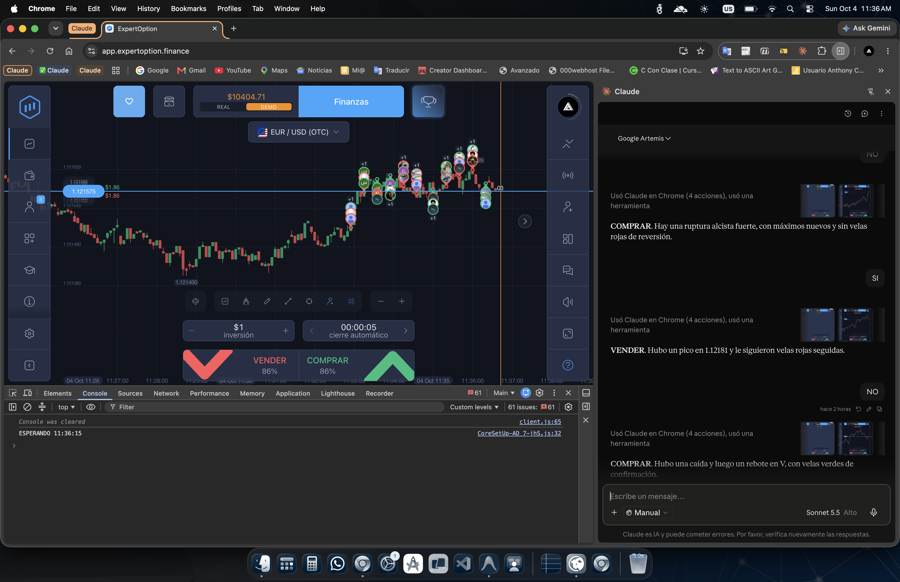

# Bot de Trading Asistido por IA para ExpertOption 📈



Este proyecto implementa un sistema para automatizar operaciones en la plataforma **ExpertOption**. Funciona leyendo en tiempo real archivos de texto generados localmente por una IA (como Claude 3.5 Sonnet / Opus) que analiza la gráfica desde el navegador.

La IA determina si la mejor acción es **COMPRAR** o **VENDER**, escribe esta palabra clave en un archivo, y el servidor local lo transmite al script del cliente (inyectado en el navegador), el cual realiza el clic automáticamente en la plataforma.

---

## 🛠️ Herramientas y Requisitos

Para que este sistema funcione, necesitas lo siguiente:

- **Node.js** (para ejecutar el servidor local).
- **Google Chrome**.
- **Extensión de Claude** (o interactuar con Claude u otra IA multimodal que pueda ver la pantalla y escribir archivos en el disco local).
- **Cuenta Demo o Real en [ExpertOption](https://app.expertoption.finance/)**.

---

## 🚀 Cómo ejecutar el proyecto

### 1. Iniciar el Servidor Local
El servidor se encargará de buscar un archivo de texto con la fecha y minuto actual (ej. `03_10_2026_17_05.txt`) y enviar su contenido al navegador.

Abre una terminal en la carpeta del proyecto y ejecuta:
```bash
npm install   # Instala las dependencias (Express, Cors, Morgan)
node server.js
```

### 2. Inyectar el Script Cliente en el Navegador
Abre [ExpertOption](https://app.expertoption.finance/) en Chrome e inicia sesión. Abre la **Consola de Herramientas para Desarrolladores** (`F12` o `Ctrl+Shift+J` / `Cmd+Option+J`) y pega el siguiente código para inyectar el script:

```javascript
const script = document.createElement('script');
script.src = 'http://localhost:3000/client.js?' + new Date().getTime();
document.body.appendChild(script);
```
> **Nota:** Se inyecta de esta manera para evadir los problemas de *Mixed Content* y restricciones de CORS/Módulos del navegador.

### 3. Controles del Bot en el Navegador
Una vez inyectado, puedes controlar el bot usando tu teclado en la pestaña de ExpertOption:
- **`Barra Espaciadora`**: Inicia/reanuda el bot (comienza a hacer peticiones al servidor).
- **`Escape (Esc)`**: Detiene el bot completamente.

---

## 🤖 Prompts Recomendados para la IA

Usa estos comandos (prompts) en tu chat con la IA que está visualizando la gráfica para entrenarla y coordinar las operaciones:

**Prompt Inicial:**
> "Quiero obtener métricas de trading desde mi cuenta demo que está abierta en el navegador. Analiza la gráfica y toma la mejor decisión para comprar/vender. Ajusta el tiempo de cierre a algo extenso para mejor visión y reduce el zoom de la gráfica. La inversión por ahora es de 1$."

**Instrucciones de Respuesta y Archivos:**
> "Solo dame una palabra: 'COMPRAR' o 'VENDER'.
> Guarda la respuesta en un archivo `.txt` en la carpeta del proyecto. 
> Los archivos deben llamarse con el nombre de la fecha y hora exacta (ejemplo: `03_10_2026_17_00.txt`)."

**Flujo de Feedback (Retroalimentación):**
> "Seré rápido. Tú creas el archivo con COMPRAR o VENDER. El sistema leerá el archivo y hará click. Yo solo te responderé con 'SI' o 'NO' en el chat para indicarte si la predicción fue acertada o no. Inmediatamente intentas con otra operación, a menos que explícitamente te pida que nos detengamos."

# Autor
> [Anthonyzok521](https://github.com/Anthonyzok521)